# 📚 Schéma du Manuel d'Algorithmes et Structures de Données

## 🏗️ Architecture Générale du Livre

```
┌─────────────────────────────────────────────────────────────────┐
│                    ALGORITHMES & STRUCTURES DE DONNÉES          │
│                         Manuel Complet                          │
└─────────────────────────────────────────────────────────────────┘
                                   │
                    ┌──────────────┼──────────────┐
                    │                             │
          ┌─────────▼─────────┐         ┌─────────▼─────────┐
          │  PARTIE I        │         │  PARTIE II       │
          │  FONDATIONS      │         │  STRUCTURES      │
          │                  │         │  LINÉAIRES       │
          └──────────────────┘         └──────────────────┘
                    │                            │
          ┌─────────┼─────────┐        ┌─────────┼─────────┐
          │         │         │        │         │         │
    ┌─────▼────┐ ┌──▼──┐ ┌───▼───┐ ┌──▼──┐ ┌───▼───┐
    │Chapitre │ │Chap│ │Chapitre│ │Chap│ │Chapitre│
    │   1     │ │ 2  │ │   3    │ │ 4  │ │   5    │
    │Intro    │ │Table│ │Listes │ │Récu│ │ Piles   │
    │         │ │aux │ │chaînées│ │rsion│ │        │
    └─────────┘ └─────┘ └───────┘ └─────┘ └───────┘
                                                  │
                                        ┌─────────┼─────────┐
                                        │         │         │
                                  ┌─────▼────┐ ┌──▼──┐ ┌───▼───┐
                                  │Chapitre │ │Chap│ │Chapitre│
                                  │   6     │ │ 7  │ │   8    │
                                  │ Files   │ │Hash│ │Arbres  │
                                  │         │ │    │ │ BST    │
                                  └─────────┘ └─────┘ └───────┘
```

## 🌳 Graphe de Dépendances des Concepts

```
FONDAMENTAUX
    │
    ├── Mathématiques Discretes
    │   ├── Complexité (Big O)
    │   ├── Notations Asymptotiques
    │   └── Analyse Algorithmique
    │
    └── Programmation
        ├── Variables & Types
        ├── Structures de Contrôle
        └── Fonctions

STRUCTURES LINÉAIRES
    │
    ├── Tableaux (Arrays)
    │   ├── Opérations de Base
    │   ├── Algorithmes de Tri
    │   └── Recherche
    │
    ├── Listes Chaînées
    │   ├── Simplement Chaînées
    │   └── Doublement Chaînées
    │
    ├── Piles (LIFO)
    │   ├── Implémentation
    │   └── Applications
    │
    └── Files (FIFO)
        ├── Implémentation
        └── Applications

STRUCTURES AVANCÉES
    │
    ├── Tables de Hachage
    │   ├── Fonctions de Hachage
    │   ├── Gestion des Collisions
    │   └── Applications
    │
    └── Arbres
        ├── Arbres Binaires de Recherche
        │   ├── Propriétés BST
        │   ├── Opérations
        │   └── Parcours
        │
        ├── Arbres Équilibrés
        │   ├── AVL Trees
        │   │   ├── Rotations
        │   │   └── Rééquilibrage
        │   │
        │   └── Red-Black Trees
        │       ├── Propriétés
        │       ├── Rééquilibrage
        │       └── Applications
        │
        └── Tas Binaires (Heaps)
            ├── Max-Heap/Min-Heap
            ├── Tri par Tas
            └── Files de Priorité

GRAPHS & ALGORITHMES
    │
    ├── Théorie des Graphes
    │   ├── Représentations
    │   ├── Types de Graphes
    │   └── Propriétés
    │
    ├── Parcours de Graphes
    │   ├── BFS (Breadth-First Search)
    │   └── DFS (Depth-First Search)
    │
    └── Algorithmes de Plus Court Chemin
        ├── Dijkstra
        ├── A* (A-Star)
        └── Bellman-Ford

PROJETS & PRATIQUE
    │
    ├── Exercices Théoriques
    │   ├── Quiz par Chapitre
    │   └── Problèmes Algorithmiques
    │
    └── Projets Pratiques
        ├── Visualisation A*
        ├── Moteur de Recherche
        ├── Simulateurs
        └── Applications Réelles
```

## 📈 Progression Pédagogique

```mermaid
graph TD
    A[Chapitre 1<br/>Introduction] --> B[Chapitre 2<br/>Tableaux & Tris]
    B --> C[Chapitre 3<br/>Listes Chaînées]
    C --> D[Chapitre 4<br/>Récursion]
    D --> E[Chapitre 5<br/>Piles]
    E --> F[Chapitre 6<br/>Files]
    F --> G[Chapitre 7<br/>Tables de Hachage]
    G --> H[Chapitre 8<br/>Arbres BST]
    H --> I[Chapitre 9<br/>Arbres AVL]
    I --> J[Chapitre 10<br/>Arbres Red-Black]
    J --> K[Chapitre 11<br/>Tas Binaires]
    K --> L[Chapitre 12<br/>Graphes]
    L --> M[Chapitre 13<br/>Plus Court Chemin]
    M --> N[Chapitre 14<br/>Projets]
    N --> O[Chapitre 15<br/>Quiz & Exercices]
    O --> P[Chapitre 16<br/>Glossaire]

    style A fill:#e1f5fe
    style B fill:#e1f5fe
    style C fill:#e1f5fe
    style D fill:#e1f5fe
    style E fill:#f3e5f5
    style F fill:#f3e5f5
    style G fill:#fff3e0
    style H fill:#fff3e0
    style I fill:#fff3e0
    style J fill:#fff3e0
    style K fill:#fff3e0
    style L fill:#e8f5e8
    style M fill:#e8f5e8
    style N fill:#fce4ec
    style O fill:#fce4ec
    style P fill:#fce4ec
```



## 🔗 Relations Entre Chapitres

### Dépendances Logiques

```
Chapitre 1 (Introduction)
├── Complexité temporelle/spatiale
├── Notations Big O
└── Concepts de base

Chapitre 2 (Tableaux & Tris)
├── Structures de données simples
├── Algorithmes de tri classiques
└── Analyse de performance

Chapitre 3 (Listes Chaînées)
├── Structures dynamiques
├── Pointeurs et références
└── Comparaison avec tableaux

Chapitre 4 (Récursion)
├── Fonctions récursives
├── Cas de base et récursif
├── Pile d'appel
└── Diviser pour régner

Chapitre 5 (Piles) & Chapitre 6 (Files)
├── Structures LIFO/FIFO
├── Implémentations (tableau/liste)
└── Applications pratiques

Chapitre 7 (Tables de Hachage)
├── Fonctions de hachage
├── Gestion des collisions
└── Recherche en O(1) moyenne

Chapitre 8 (BST)
├── Arbres binaires
├── Propriété d'ordre
├── Opérations (insertion/recherche)
└── Déséquilibre potentiel

Chapitre 9 (AVL) & Chapitre 10 (Red-Black)
├── Équilibrage automatique
├── Rotations complexes
├── Propriétés d'équilibre
└── Applications système

Chapitre 11 (Tas Binaires)
├── Arbres complets
├── Propriété de tas
├── Tri par tas (HeapSort)
└── Files de priorité

Chapitre 12 (Graphes)
├── Représentations (liste/matrice)
├── Parcours BFS/DFS
├── Applications diverses
└── Problèmes complexes

Chapitre 13 (Plus Court Chemin)
├── Graphes pondérés
├── Algorithme de Dijkstra
├── A* avec heuristique
└── Bellman-Ford

Chapitre 14 (Projets)
├── Application pratique
├── Visualisation interactive
├── Problèmes réels
└── Intégration des concepts

Chapitre 15 (Quiz & Exercices)
└── Révision et validation

Chapitre 16 (Glossaire)
└── Référence terminologique
```

## 🎯 Carte Mentale des Concepts Clés

```
ALGORITHMIQUE
├── COMPLEXITÉ
│   ├── Temps d'exécution
│   ├── Espace mémoire
│   ├── Big O, Ω, Θ
│   └── Cas meilleur/moyen/pire
│
├── STRUCTURES DE DONNÉES
│   ├── Linéaires
│   │   ├── Tableaux (contigus)
│   │   ├── Listes chaînées (dynamiques)
│   │   ├── Piles (LIFO)
│   │   └── Files (FIFO)
│   │
│   ├── Arbres
│   │   ├── Binaires de recherche
│   │   ├── Équilibrés (AVL, Red-Black)
│   │   └── Tas (Heaps)
│   │
│   ├── Graphes
│   │   ├── Orientés/Non-orientés
│   │   ├── Pondérés/Non-pondérés
│   │   └── Représentations
│   │
│   └── Tables de hachage
│       ├── Hachage parfait
│       ├── Collisions
│       └── Applications
│
└── ALGORITHMES
    ├── Tri
    │   ├── Quadratiques (Bulle, Insertion)
    │   ├── Log-linéaires (Fusion, Rapide)
    │   └── Linéaires (Comptage)
    │
    ├── Recherche
    │   ├── Linéaire
    │   ├── Binaire
    │   └── Dans arbres/graphes
    │
    ├── Récursion
    │   ├── Cas de base
    │   ├── Cas récursif
    │   └── Mémoïsation
    │
    └── Graphes
        ├── Parcours (BFS/DFS)
        ├── Plus court chemin
        └── Optimisation
```

## 📊 Métriques du Livre

| Section | Chapitres | Lignes Code | Exercices | Complexité |
|---------|-----------|-------------|-----------|------------|
| **I - Fondations** | 4 | ~500 | 15 | O(1) à O(n²) |
| **II - Linéaires** | 4 | ~800 | 20 | O(1) à O(n) |
| **III - Avancées** | 4 | ~1200 | 25 | O(log n) |
| **IV - Graphes** | 2 | ~600 | 15 | O(V + E) |
| **V - Pratique** | 1 | ~300 | 10 | Variable |
| **Annexes** | 2 | ~200 | 50+ | Révision |

## 🏆 Parcours d'Apprentissage Recommandé

### Niveau Débutant
```
1 → 2 → 3 → 5 → 6 → 7 → 8 → 15 → 16
```

### Niveau Intermédiaire
```
1 → 2 → 3 → 4 → 5 → 6 → 7 → 8 → 9 → 11 → 12 → 15 → 16
```

### Niveau Avancé
```
1 → 2 → 3 → 4 → 5 → 6 → 7 → 8 → 9 → 10 → 11 → 12 → 13 → 14 → 15 → 16
```

### Focus Spécialisé
- **Systèmes** : 8 → 9 → 10 → 11
- **Jeux** : 12 → 13 → 14
- **Web** : 7 → 12 → 14

---

*Ce schéma montre l'architecture complète du manuel et les relations entre concepts. Utilisez-le pour naviguer efficacement dans votre apprentissage !* 🗺️
